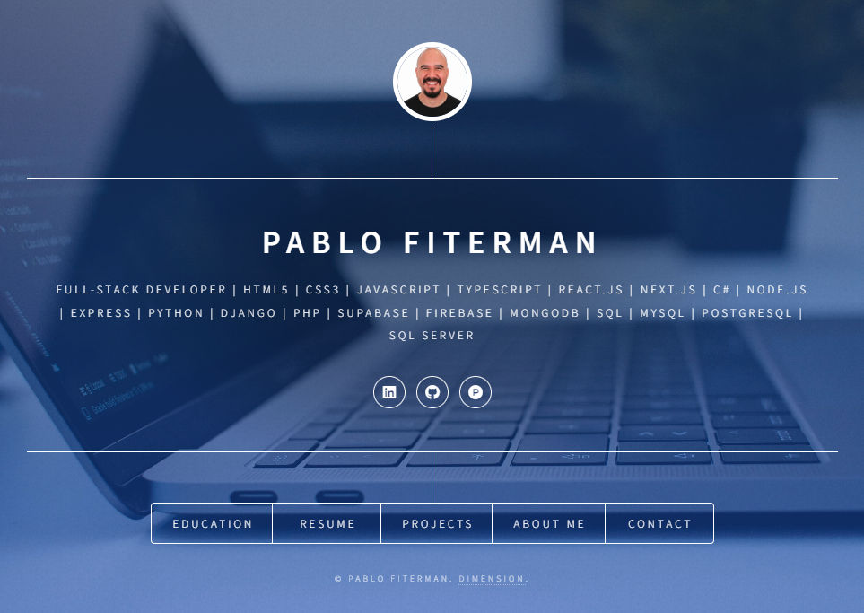

## 👋 Introduction

A professional resume page, where you can explore my career journey, skills, and accomplishments in detail. This platform showcases my experience, qualifications, and the projects I've contributed to, offering a comprehensive view of my professional background. Whether you're a recruiter, collaborator, or simply interested in my work, you'll find all the essential information here.

## 🌟 Features

- **Responsive** : It ensures an optimal user experience by adjusting layouts, images, and content dynamically, making the interface visually appealing and functional on desktops, tablets, and mobile devices.
- **Education** : Allow users to view the degree(s) I have obtained, field of study, university, graduation date and relevant projects.
- **Resume** : Users can view my professional experience and download my latest resume.
- **About Me** : Users can view a brief description of me and my professional goals.
- **Contact** : Users are abble to send messages directly to my email through the website.

## 👩🏻‍💻 Technologies

- **HTML5** : Provide powerful new features for building the structure of your page improving the user experience across devices.
- **CSS** : It ensures a consistent, visually appealing experience across different devices and screen sizes.
- **JavaScript** : Powerful and essential tool for creating dynamic, interactive, and modern web experiences.
- **jQuery** : jQuery is a fast, small, and feature-rich JavaScript library.

## 🔗 Reference

- <a href="https://html5up.net/" target="_blank">HTML5 UP</a>
- <a href="https://unsplash.com/" target="_blank">Unspash</a>
- <a href="fontawesome.io" target="_blank">Fontawesome</a>
- <a href="https://jquery.com/">jQuery</a>
